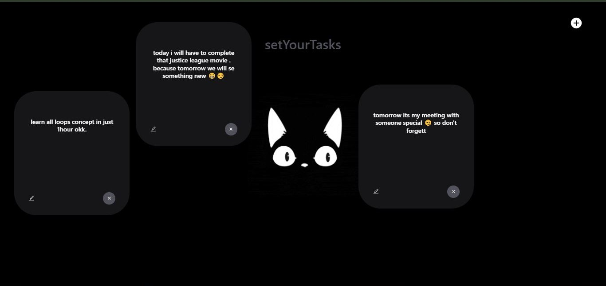

# 🐾 Animated ToDo - setYourTasks

Welcome to **Animated ToDo**, a unique and fun task management web app built using **ReactJS**, **Tailwind CSS**, and **Framer Motion**. This project gives your boring to-do lists a playful and engaging twist by making the task cards fully draggable with a smooth animation.

## 🔥 Features

- 📝 Add your daily tasks in animated cards
- 🧲 Drag the cards anywhere on the screen
- 🧱 Collision detection - cards bounce off the screen edges
- ✏️ Edit or ❌ delete any task anytime
- 😎 Cool cat animation in the center for a unique vibe
- ⚡️ Super smooth animations using **Framer Motion**

## 🛠️ Tech Stack

- **ReactJS** – Frontend Framework
- **Tailwind CSS** – Styling
- **Framer Motion** – Animations and draggable behavior
- **Vite** – Fast build tool for development and production

## 🚀 Live Demo

🔗 [Check out the live site here](https://priyanshu579.github.io/animatedTodo)

## 📸 Screenshot

## 🙋‍♂️ Author

**Priyanshu Sharma**  
Frontend Developer  
📧 Connect with me: [LinkedIn](https://www.linkedin.com/in/priyanshu-sharma-123408251) | [GitHub](https://github.com/Priyanshu579)

